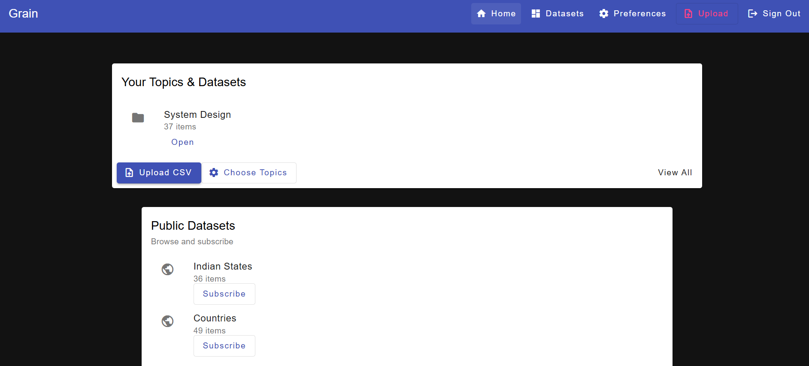
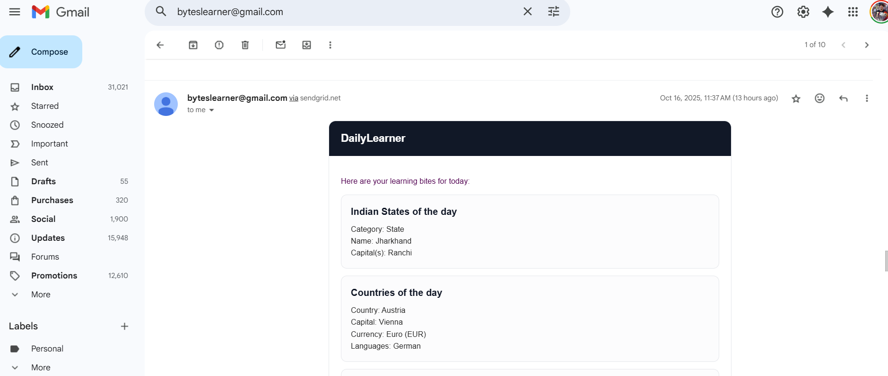
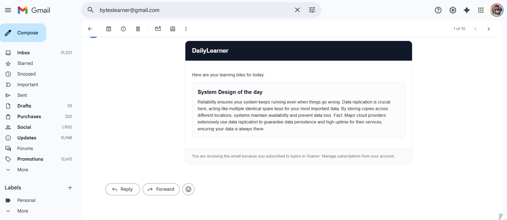

# Grainer

Grainer is a web application designed to help users learn and manage datasets effectively. It provides features like uploading datasets, subscribing to public datasets, and receiving daily learning bites via email.

---

## Features

### 1. **Dashboard**
- View your topics and datasets.
- Upload CSV files to create new datasets.
- Browse and subscribe to public datasets.

### 2. **Public Datasets**
- Explore datasets like Indian States, Countries, and more.
- Subscribe to datasets to receive daily learning bites.

### 3. **Daily Learning Emails**
- Receive personalized learning bites via email.
- Learn about topics like System Design, Indian States, and Countries.

---

## Screenshots

### Dashboard
![Dashboard]


### Daily Learning Email Without AI
![Daily Learning Email]

### Daily Learning Email With AI
![Daily Learning Email]
---

## Installation

### Prerequisites
- Node.js
- Angular CLI
- Backend API hosted at `https://grainer.onrender.com`

### Steps
1. Clone the repository:
   ```bash
   git clone https://github.com/your-repo/grainer.git
   cd grainer/frontend/grain-ui